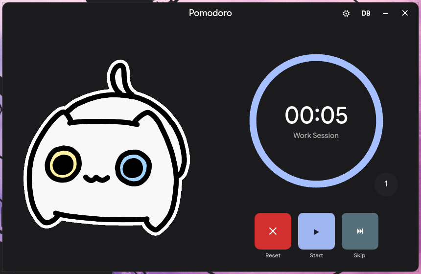

# 🍅 Pomodoro Timer

Aplicación de escritorio para la técnica Pomodoro construida con **Qt6**, **QML** y **C++**, compilada con **CMake**.

---

## 📸 Preview



---

## ✨ Características

- Temporizador automático con anillo de progreso visual
- Contador de ciclos Pomodoro
- Estados automáticos: Work Session → Short Break → Long Break
- GIF animado que cambia según el estado
- Sonido de notificación al terminar cada ciclo
- Notificaciones del sistema
- Ícono en la bandeja del sistema
- Historial de sesiones en base de datos SQLite
- Configuración de duraciones, opacidad y tamaño de fuente
- Persistencia del estado entre sesiones

---

## 🖼️ Assets

Los archivos de `assets/` **no están incluidos en el repositorio**. Debes colocarlos manualmente en `pomodoro/assets/` antes de compilar:

| Archivo | Descripción | Fuente |
|---|---|---|
| `focus.gif` | GIF para sesión de trabajo | [circlecan](https://circlecan.blogspot.com/p/gif-page-3.html) |
| `break.gif` | GIF para descanso | [circlecan](https://circlecan.blogspot.com/p/gif-page-3.html) |
| `start.gif` | GIF para pantalla inicial | [circlecan](https://circlecan.blogspot.com/p/gif-page-3.html) |
| `pause.gif` | GIF para pausa | [circlecan](https://circlecan.blogspot.com/p/gif-page-3.html) |
| `tuturu_1.mp3` | Sonido de notificación | Página de button sounds |

> Los GIFs son obra de **circlecan** — contacto: circlecan33@gmail.com

---

## 🔧 Requisitos

- Qt 6.10 o superior (módulos: `Quick`, `Widgets`, `Sql`, `Multimedia`)
- CMake 3.16 o superior
- Compilador con soporte C++17

### Arch Linux

```/dev/null/install.sh
sudo pacman -S qt6-base qt6-declarative qt6-multimedia cmake
```

### Ubuntu / Debian

```/dev/null/install.sh
sudo apt install qt6-base-dev qt6-declarative-dev qt6-multimedia-dev cmake
```

---

## 🔨 Compilación

```/dev/null/build.sh
cmake -S . -B build
cmake --build build --parallel
./build/apppomodoro
```
